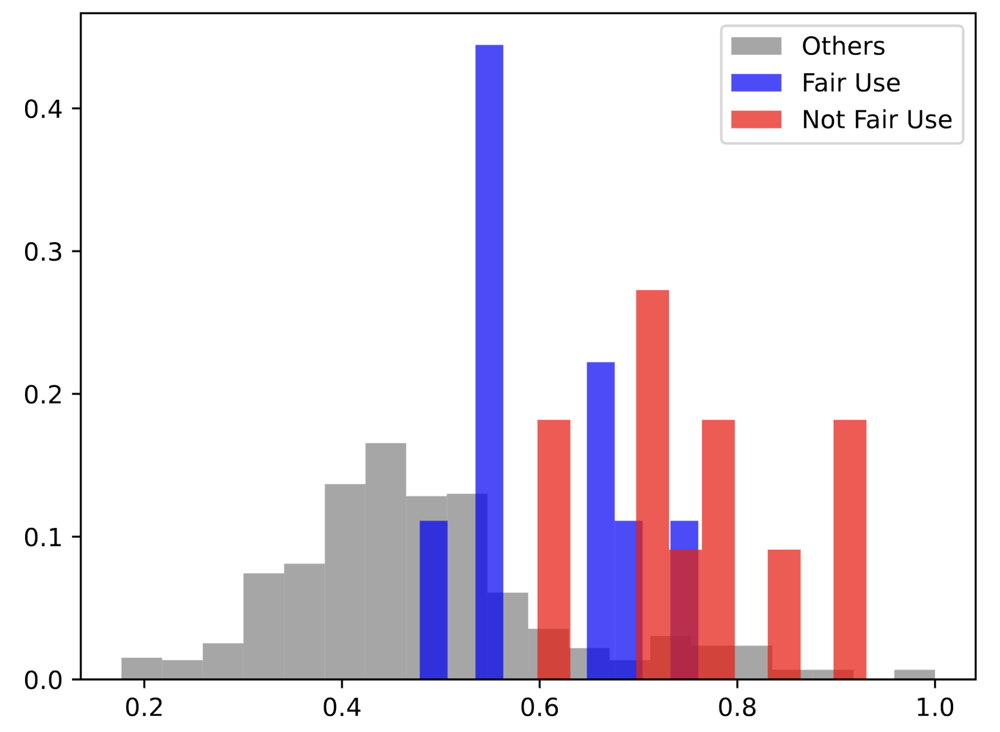

# AI Royalties
An IP framework to compensate artists and IP-holders for AI-generated content

### Abstract
This article investigates how AI-generated content can disrupt central revenue streams of the creative industries, in particular the collection of dividends from intellectual property (IP) rights. It reviews the IP and copyright questions related to the input and output of generative AI systems. A systematic method is proposed to assess whether AI-generated outputs, especially images, violate previous copyrights, using a CLIP metric between images against historical copyright rulings. An examination (economic and technical feasibility) of previously proposed compensation frameworks reveals their financial implications for creatives and IP holders. Lastly, we propose a novel IP framework for compensation of artists and IP holders based on their published ``licensed AIs'' as a new medium and asset from which to collect AI royalties.

### Copyright Infringement Metric
Any metric to measure whether or not a new image constitutes sufficient transformation for fair use or violates previous copyrights must: 
* ... identify identical images beyond formats, aspect ratios, or indistinguishable pixel alterations
* ... identify transformed images of a same work or subject 
* ... identify different images referencing identical subjects 
* ... integrate the subjective elements of precedent jury's decisions and court rulings

Because they combine technical dimensions with subjective social aspects, the metric most go beyond pure visual analysis of the images.
We propose an AI metric combining pixel processing of images with contextual language. One such metric that has recently come to prominence is CLIP. [CLIP models](https://arxiv.org/pdf/2103.00020.pdf)1 are a family of image understanding models that were made freely available by different research organizations such as OpenAI, Stability.AI, and others. 
Because CLIP models are trained to recognize the similarity between an image and a caption, they combine elements of language and visual intelligence of image that could be repurposed to assess the level of transformation an original image has undergone, and interpret it in light of precedent copyright rulings.

### Dataset of Images in United States Fair Use Rulings
We assessed previous copyright rulings in the U.S. mostly focused on visual image, looking at [10 significant rulings](https://drive.google.com/drive/folders/1OUvZeKKgi26gzMdPweo5WY5Zys1u5deA?usp=drive_link) opposing an original work to a derivative one (some rulings involving more than 1 original-derivative pair), and whether the transformation was considered fair use or copyright violation. 

**Cases Assessed**:
* Ruled Fair Use
  * _Marano v. Metro. Museum of Art, 844 F. App’x 436 (2d Cir. 2021)_
  * _Blanch v. Koons, 467 F.3d 244 (2d Cir. 2006)_
  * _Kienitz v. Sconnie Nation, 766 F.3d 756 (7th Cir. 2014)_
  * _Seltzer v. Green Day, Inc., 725 F.3d 1170 (9th Cir. 2013)_
* Ruled NOT Fair Use
  * _Morris v. Guetta, No. LA CV12-00684 JAK (RZX) (C.D. Cal. Feb. 4, 2013)_
  * _Andy Warhol Foundation for the Visual Arts, Inc. v. Goldsmith, (598 U.S. ___, 2023)_
  * _Dr. Seuss Enters., L.P. v. ComicMix LLC, 983 F.3d 443 (9th Cir. 2020)_
  * _Dam Things From Denmark v. Russ Berrie & Co., 173 F. Supp. 2d 277 (D.N.J. 2001)_
  * _O’Neil v. Ratajkowski, No. 19 CIV. 9769 (AT), 2021 WL 4443259 (S.D.N.Y. Sept. 28, 2021)_
* Mixed Ruling (Both Fair Use and NOT Fair Use)
  * _Cariou v. Prince, 714 F.3d 694 (2d Cir. 2013)_

While there are 4 factors of copyright fair use in the U.S., we attempted to limit our assessment to factor #3, which has to do with the similarity of the images in question. There is no perfect way to do this -- given the relatively few cases related to factor #3 and visual image.

---
**17 U.S.C. §107: Four Factors for Copyright Fair Use**
> 1. The purpose and character of the use, including whether such use is of a commercial nature or is for nonprofit educational purposes
> 2. The nature of the copyrighted work
> 3. **The amount and substantiality of the portion used in relation to the copyrighted work as a whole**
> 4. The effect of the use upon the potential market for or value of the copyrighted work
---
To find the rulings, we searched the [U.S. Copyright Office Fair Use Index Database](https://www.copyright.gov/fair-use/fair-index.html)2 -- specifically selecting categories "photograph", "painting/drawing/graphic", and "film/audiovisual". We also avoided the inlcusion of "parody/satire" rulings, as these tend to fall under the first factor of fair use ("purpose and character of the use"). 

Our dataset of original-derivative images from the 10 rulings can be found [here](https://drive.google.com/drive/folders/1OUvZeKKgi26gzMdPweo5WY5Zys1u5deA?usp=drive_link).

### Measuring CLIP Distance
[We measured the CLIP distance for every pair in our dataset](CaseAnalysis.ipynb).

#### CLIP distance between cases

| CLIP distance            | Mean | Standard Deviation       |
|--------------------------|------|--------------------------|
| Not contested            |      |                          |
| Contested                |      | 0.6 < CLIP ≤ 0.7         |
| - Fair use               |      | 0.7 < CLIP               |
| - Not fair use           |      | 0.7 < CLIP               |

In the above figure, the CLIP distance between images ruled as fair use is documented in green, that between those ruled not fair use (copyright infringements) in red, those in blue were deemed probably not fair use, while the CLIP distance between all other pairs is documented in grey. 

We see a clear distinction between uncontested images, and contested ones, with the average CLIP distance between uncontested image pairs around 0.5, while that for those contested around 0.69. Moreover, for contested images, CLIP is able to discern between those ruled fair use (mean of 0.6), and those infringing copyright (mean of 0.76), with a resolution beyond the first standard deviation. 
Examples of contested image pairs are documented in figure \ref{fig:Copyright cases and metric}, along with their respective CLIP distance. 

A copyright infringement metric based on CLIP is therefore possible with the thresholds proposed in the below table:

#### Copyright & fair use metric (CLIP-based thresholds)

| (If contested)                  | CLIP distance              |
|--------------------------------|----------------------------|
| Copyright safe                 | CLIP ≤ 0.6                 |
| Likely fair use                | 0.6 < CLIP ≤ 0.7           |
| Likely copyright infringement  | 0.7 < CLIP                 |

Note that starting from a CLIP base, additional fine-tuning on copyright cases would produce a metric with a more resolution power. 

